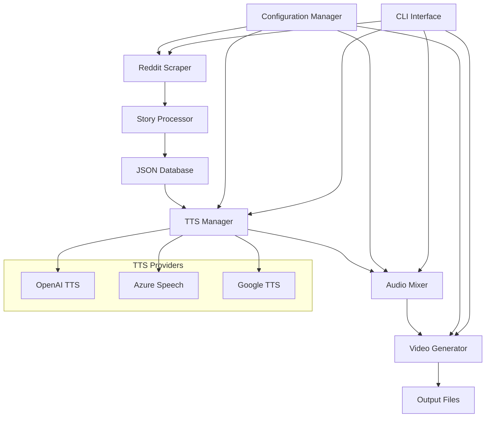

<div align="center">

# 🎭 CreepyPasta AI 👻

**AI-Powered Horror Story Narration with Atmospheric Multimedia Experiences**

[](https://www.python.org/downloads/)
[](https://opensource.org/licenses/MIT)
[](https://github.com/yourusername/creepypastaAI)
[](https://github.com/psf/black)
[](CONTRIBUTING.md)

[🚀 Quick Start](#-quick-start) • [📖 Documentation](#-table-of-contents) • [🔧 Installation](#-installation) • [💡 Examples](#-usage-examples) • [🤝 Contributing](#-contributing)

</div>

---

## 📋 Table of Contents

- [🎯 Target Audience](#-target-audience)
- [✨ Key Features](#-key-features)
- [🏗️ Architecture](#%EF%B8%8F-architecture)
- [🔧 Installation](#-installation)
- [⚙️ Configuration](#%EF%B8%8F-configuration)
- [🚀 Quick Start](#-quick-start)
- [💡 Usage Examples](#-usage-examples)
- [🔄 Execution Modes](#-execution-modes)
- [📊 Project Structure](#-project-structure)
- [🎵 Audio & Video Features](#-audio--video-features)
- [🛠️ API Documentation](#%EF%B8%8F-api-documentation)
- [🔍 Troubleshooting](#-troubleshooting)
- [❓ FAQ](#-faq)
- [🤝 Contributing](#-contributing)
- [📄 License](#-license)
- [📞 Support & Contact](#-support--contact)

---

## 🔍 SEO Keywords

`creepypasta`, `AI narration`, `text-to-speech`, `horror stories`, `Reddit scraper`, `audio generation`, `video creation`, `atmospheric audio`, `Python automation`, `multimedia content`, `TTS voices`, `OpenAI`, `Azure Speech`, `content creation`, `horror content generator`

---

## 🎯 Target Audience

**CreepyPasta AI** is designed for:
- 🎬 **Content Creators** who want automated horror story narration
- 📱 **Social Media Managers** creating engaging horror content
- 🎙️ **Podcasters** looking for atmospheric audio experiences
- 👨‍💻 **Developers** interested in AI-powered content generation
- 🎨 **Horror Enthusiasts** who enjoy immersive storytelling experiences

---

## ✨ Key Features

### 🤖 AI-Powered Content Generation
- **Multi-Provider TTS**: OpenAI, Azure Speech Services, Google TTS with intelligent fallback
- **Natural Voice Selection**: Multiple voice options including horror-optimized tones
- **Smart Text Processing**: Automatic text cleaning and optimization for speech synthesis
- **AI-Generated Imagery**: Create atmospheric horror visuals for video content

### 📊 Data Management & Intelligence  
- **Reddit Integration**: Automated scraping from r/creepypasta with intelligent filtering
- **Smart Duplicate Detection**: Advanced algorithms prevent content repetition
- **JSON Database**: Comprehensive story tracking with metadata and analytics
- **Content Quality Scoring**: Automatic story quality assessment and filtering

### 🎵 Professional Audio Production
- **Atmospheric Audio Mixing**: Background music, sound effects, and ambient noise
- **Professional Audio Effects**: Echo, reverb, and horror-specific audio enhancements
- **Multi-Format Export**: MP3, WAV, and other popular audio formats
- **Volume Normalization**: Consistent audio levels across all generated content

### 🎬 Video Generation & Multimedia
- **Automated Video Creation**: Sync narration with AI-generated horror imagery
- **Visual Effects**: Atmospheric lighting, transitions, and horror-themed effects
- **Multiple Output Formats**: MP4, AVI support with customizable quality settings
- **Thumbnail Generation**: Automatic creation of engaging video thumbnails

### ⚡ Performance & Scalability
- **Batch Processing**: Generate multiple stories simultaneously
- **Resource Optimization**: Efficient memory and CPU usage management
- **Cross-Platform**: Full Windows, macOS, and Linux compatibility
- **Modular Architecture**: Run individual components independently

---

## 🏗️ Architecture



---

## 🔧 Installation

### Prerequisites

> **⚠️ Important**: Ensure you have **FFmpeg** installed for audio/video processing
> - **Windows**: Download from [ffmpeg.org](https://ffmpeg.org/download.html) and add to PATH
> - **macOS**: `brew install ffmpeg`
> - **Linux**: `sudo apt install ffmpeg` (Ubuntu/Debian) or equivalent

- **Python 3.8 or higher** (Python 3.13 recommended)
- **Git** for cloning the repository
- **Reddit API credentials** (free registration required)
- **Optional**: OpenAI or Azure API keys for premium TTS voices

### Step-by-Step Installation

1. **Clone the Repository**
   ```bash
   git clone https://github.com/yourusername/creepypastaAI.git
   cd creepypastaAI
   ```

2. **Create Virtual Environment** (Recommended)
   ```bash
   python -m venv creepypasta_env
   
   # Activate virtual environment
   # Windows:
   creepypasta_env\Scripts\activate
   
   # macOS/Linux:
   source creepypasta_env/bin/activate
   ```

3. **Install Dependencies**
   ```bash
   pip install -r requirements.txt
   ```

4. **Set Up Environment Variables**
   ```bash
   # Copy the example environment file
   cp .env.example .env  # Windows: copy .env.example .env
   ```

5. **Configure API Credentials** (Edit `.env` file)
   ```env
   # Reddit API (Required - Get from https://www.reddit.com/prefs/apps)
   REDDIT_CLIENT_ID=your_client_id_here
   REDDIT_CLIENT_SECRET=your_client_secret_here
   REDDIT_USER_AGENT=CreepyPastaAI/1.0
   
   # OpenAI API (Optional - Premium TTS)
   OPENAI_API_KEY=your_openai_api_key_here
   
   # Azure Speech (Optional - Premium TTS)
   AZURE_SPEECH_KEY=your_azure_key_here
   AZURE_SPEECH_REGION=your_region_here
   ```

6. **Verify Installation**
   ```bash
   python main.py --info
   ```

---

## ⚙️ Configuration

### Environment Variables (`.env`)

| Variable | Required | Description | Example |
|----------|----------|-------------|---------|
| `REDDIT_CLIENT_ID` | ✅ | Reddit API client ID | `abc123def456` |
| `REDDIT_CLIENT_SECRET` | ✅ | Reddit API client secret | `secret_key_here` |
| `REDDIT_USER_AGENT` | ✅ | User agent for Reddit API | `CreepyPastaAI/1.0` |
| `OPENAI_API_KEY` | ❌ | OpenAI API key for premium TTS | `sk-proj-...` |
| `AZURE_SPEECH_KEY` | ❌ | Azure Speech Services key | `azure_key_here` |
| `AZURE_SPEECH_REGION` | ❌ | Azure region | `eastus` |
| `NUM_STORIES` | ❌ | Default number of stories to process | `10` |
| `DEBUG` | ❌ | Enable debug logging | `false` |

### Application Settings (`config/settings.yaml`)

```yaml
reddit:
  subreddit: "creepypasta"
  limit: 10
  min_score: 5              # Minimum upvotes required
  min_length: 500           # Minimum character count
  max_length: 10000         # Maximum character count

tts:
  provider: "openai"        # Options: gtts, openai, azure
  language: "en"
  
  openai:
    model: "tts-1"          # Options: tts-1, tts-1-hd
    voice: "onyx"           # Options: alloy, echo, fable, onyx, nova, shimmer
    speed: 1.0              # Speech speed (0.25 to 4.0)
  
  azure:
    voice: "en-US-AriaNeural"
    rate: "+0%"             # Speech rate adjustment
    pitch: "+0Hz"           # Pitch adjustment

audio:
  background_music: true
  music_volume: 0.3         # Background music volume (0.0 to 1.0)
  voice_volume: 0.8         # Narration volume (0.0 to 1.0)
  effects: true             # Enable audio effects
  sample_rate: 44100        # Audio sample rate
  format: "mp3"             # Output format

video:
  enabled: true
  resolution: "1920x1080"   # Video resolution
  fps: 30                   # Frames per second
  background_images: true   # Use AI-generated backgrounds
  subtitles: false          # Include subtitles

output:
  directory: "assets/output"
  audio_format: "mp3"
  video_format: "mp4"
  organize_by_date: true    # Create date-based folders
```

---

## 🚀 Quick Start

### Basic Usage

```bash
# Generate 5 complete stories (scrape → audio → video)
python main.py --mode complete --stories 5

# Quick test with 1 story
python main.py --stories 1
```

### Getting Reddit API Credentials

1. Go to https://www.reddit.com/prefs/apps
2. Click "Create App" or "Create Another App"
3. Choose "script" as the application type
4. Fill in the required information:
   - **Name**: `CreepyPasta AI`
   - **Description**: `AI-powered creepypasta narration`
   - **About URL**: (optional)
   - **Redirect URI**: `http://localhost:8080`
5. Copy the **client ID** (under the app name) and **client secret**
6. Add these to your `.env` file

---

## 💡 Usage Examples

### Example 1: Complete Workflow
```bash
# Generate 3 stories with full processing
python main.py --mode complete --stories 3

# Use specific TTS provider
python main.py --mode complete --stories 5 --tts openai
```

### Example 2: Individual Components
```bash
# Only scrape stories (no audio/video generation)
python main.py --mode scrape --stories 10

# Generate audio for existing stories
python main.py --mode audio

# Create videos for existing audio files
python main.py --mode video
```

### Example 3: Using Convenience Scripts

**Windows:**
```cmd
# Run complete workflow for 5 stories
scripts\complete.bat 5

# Scrape 20 stories only
scripts\scrape.bat 20

# Generate audio only
scripts\audio.bat

# Check system status
scripts\status.bat
```

**Linux/macOS:**
```bash
# Run complete workflow for 5 stories
./scripts/complete.sh 5

# Scrape 20 stories only
./scripts/scrape.sh 20

# Generate audio only
./scripts/audio.sh

# Check system status
./scripts/status.sh
```

### Example 4: Advanced Configuration
```bash
# Use custom configuration file
python main.py --config custom_settings.yaml

# Enable debug mode
python main.py --debug --stories 1

# Specify output directory
python main.py --output /path/to/output --stories 3
```

---

## 🔄 Execution Modes

CreepyPasta AI supports flexible execution modes for different use cases:

| Mode | Description | Command | Use Case |
|------|-------------|---------|----------|
| **Complete** | Full pipeline: scrape → audio → video | `--mode complete` | Production use, full automation |
| **Scrape** | Story collection only | `--mode scrape` | Data gathering, content research |
| **Audio** | Audio generation only | `--mode audio` | Audio content creation |
| **Video** | Video generation only | `--mode video` | Video content creation |
| **Info** | System information | `--info` | Troubleshooting, configuration check |
| **Stats** | Database statistics | `--stats` | Analytics, progress tracking |

### Benefits of Modular Execution
- 🔧 **Development & Testing**: Test individual components
- 🔄 **Error Recovery**: Resume from specific steps if failures occur
- 💾 **Resource Management**: Run resource-intensive operations separately
- 📊 **Batch Processing**: Process large numbers of stories in stages
- 🎯 **Selective Processing**: Generate content for specific steps only

---

## 📊 Project Structure

```
creepypastaAI/
├── 📁 src/                     # Source code modules
│   ├── 🎵 audio/               # Audio processing components
│   │   ├── tts_manager.py      # Text-to-speech management
│   │   └── audio_mixer.py      # Audio mixing and effects
│   ├── 💻 cli/                 # Command-line interface
│   │   ├── cli_handler.py      # Argument parsing and validation
│   │   └── execution_modes.py  # Mode-specific execution handlers
│   ├── 🌐 scrapers/            # Data collection modules
│   │   └── reddit_scraper.py   # Reddit API integration
│   ├── 🔧 utils/               # Utility modules
│   │   ├── config_manager.py   # Configuration handling
│   │   ├── story_processor.py  # Text processing and validation
│   │   ├── story_tracker.py    # JSON database management
│   │   └── logger.py           # Logging utilities
│   └── 🎬 video/               # Video generation components
│       └── video_generator.py  # Video creation and effects
├── ⚙️ config/                  # Configuration files
│   └── settings.yaml           # Main application configuration
├── 💾 data/                    # Persistent data storage
│   └── generated_stories.json  # Story database with metadata
├── 🎨 assets/                  # Static assets and generated content
│   ├── images/                 # AI-generated horror imagery
│   ├── music/                  # Background music and sound effects
│   ├── output/                 # Generated audio files
│   └── videos/                 # Generated video content
├── 🧪 tests/                   # Test modules and validation
├── 📜 scripts/                 # Convenience execution scripts
├── 📚 docs/                    # Project documentation
├── 📝 logs/                    # Application logs
└── 🚀 main.py                  # Application entry point
```

---

## 🎵 Audio & Video Features

### Audio Processing Capabilities
- **Multi-Provider TTS**: Seamless switching between OpenAI, Azure, and Google TTS
- **Voice Customization**: Speed, pitch, and tone adjustments
- **Atmospheric Mixing**: Horror-themed background music and sound effects
- **Audio Effects**: Reverb, echo, and distortion for immersive experience
- **Volume Normalization**: Consistent audio levels across all content

### Video Generation Features
- **AI-Generated Imagery**: Horror-themed visuals created with AI models
- **Dynamic Transitions**: Smooth scene changes and visual effects
- **Text Overlays**: Subtitles and title cards (optional)
- **Multiple Formats**: Support for various video formats and resolutions
- **Thumbnail Generation**: Automatic creation of engaging video previews

---

## 🛠️ API Documentation

### Core Classes and Methods

#### `RedditScraper`
```python
from src.scrapers.reddit_scraper import RedditScraper

scraper = RedditScraper()
stories = scraper.fetch_stories(limit=10, min_score=5)
```

#### `TTSManager`
```python
from src.audio.tts_manager import TTSManager

tts = TTSManager(provider="openai")
audio_file = tts.generate_speech(text="Your story here", voice="onyx")
```

#### `VideoGenerator`
```python
from src.video.video_generator import VideoGenerator

generator = VideoGenerator()
video_file = generator.create_video(audio_file, background_images=True)
```

### Configuration API
```python
from src.utils.config_manager import ConfigManager

config = ConfigManager()
config.set_tts_provider("azure")
config.set_audio_effects(True)
```

---

## 🔍 Troubleshooting

### Common Issues and Solutions

#### 🔴 FFmpeg Not Found
**Error**: `FFmpeg not found in system PATH`
**Solution**: 
- **Windows**: Download from [ffmpeg.org](https://ffmpeg.org) and add to PATH
- **macOS**: `brew install ffmpeg`
- **Linux**: `sudo apt install ffmpeg`

#### 🔴 Reddit API Authentication Failed
**Error**: `Invalid Reddit credentials`
**Solution**:
1. Verify your `.env` file has correct Reddit API credentials
2. Check that REDDIT_CLIENT_ID and REDDIT_CLIENT_SECRET are set
3. Ensure REDDIT_USER_AGENT follows format: `AppName/Version`

#### 🔴 TTS Provider Errors
**Error**: `OpenAI API key invalid` or `Azure Speech key invalid`
**Solution**:
- Verify API keys in `.env` file
- Check API key permissions and quotas
- Try fallback to Google TTS: `--tts gtts`

#### 🔴 Memory Issues with Large Stories
**Error**: `Memory error during processing`
**Solution**:
- Process fewer stories at once: `--stories 1`
- Use text chunking for very long stories
- Increase system virtual memory

#### 🔴 Permission Errors
**Error**: `Permission denied writing to output directory`
**Solution**:
- Run with appropriate permissions
- Check output directory write permissions
- Try different output directory: `--output /different/path`

### Debugging Tips
```bash
# Enable verbose logging
python main.py --debug --stories 1

# Check system configuration
python main.py --info

# Validate configuration files
python main.py --validate-config
```

---

## ❓ FAQ

### General Questions

**Q: Is CreepyPasta AI free to use?**
A: Yes! The core functionality uses free APIs (Reddit, Google TTS). Premium features (OpenAI/Azure TTS) require paid API keys but are optional.

**Q: What Python versions are supported?**
A: Python 3.8 or higher. Python 3.13 is recommended for best performance.

**Q: Can I use my own stories instead of Reddit?**
A: Yes! You can add stories directly to the JSON database or modify the scraper to use different sources.

### Technical Questions

**Q: How do I add custom background music?**
A: Place your audio files in `assets/music/` and update the configuration in `settings.yaml`.

**Q: Can I customize the TTS voices?**
A: Yes! Each provider offers different voices. Configure them in `settings.yaml` under the `tts` section.

**Q: How do I schedule automatic story generation?**
A: Use system schedulers:
- **Windows**: Task Scheduler
- **Linux/macOS**: Cron jobs
- **Docker**: Scheduled containers

### Performance Questions

**Q: How long does it take to process one story?**
A: Typically 2-5 minutes per story, depending on length and TTS provider.

**Q: Can I process multiple stories simultaneously?**
A: Yes! Use batch processing: `python main.py --stories 10` processes stories in optimized batches.

**Q: What are the system requirements?**
A: Minimum 4GB RAM, 2GB free disk space. SSD recommended for better performance.

---

## 🤝 Contributing

We welcome contributions from the community! Here's how you can help:

### Getting Started
1. **Fork** the repository
2. **Create** a feature branch: `git checkout -b feature/amazing-feature`
3. **Make** your changes and add tests
4. **Commit** your changes: `git commit -m 'Add amazing feature'`
5. **Push** to the branch: `git push origin feature/amazing-feature`
6. **Open** a Pull Request

### Development Guidelines
- Follow PEP 8 style guidelines
- Add tests for new functionality
- Update documentation for API changes
- Use descriptive commit messages

### What We're Looking For
- 🐛 Bug fixes and error handling improvements
- ✨ New TTS provider integrations
- 🎨 UI/UX enhancements for CLI
- 📚 Documentation improvements
- 🧪 Additional test coverage
- 🌍 Internationalization support

### Code of Conduct
Please read our [Code of Conduct](CODE_OF_CONDUCT.md) before contributing.

---

## 📄 License

This project is licensed under the MIT License - see the [LICENSE](LICENSE) file for details.

### Third-Party Licenses
- **Reddit API**: Subject to Reddit API Terms of Service
- **OpenAI API**: Subject to OpenAI Terms of Use
- **Azure Speech Services**: Subject to Microsoft Azure Terms

---

## 📞 Support & Contact

### Getting Help

- 📖 **Documentation**: Check this README and `/docs` folder
- 🐛 **Bug Reports**: [Open an issue](https://github.com/yourusername/creepypastaAI/issues)
- 💡 **Feature Requests**: [Create a feature request](https://github.com/yourusername/creepypastaAI/issues/new?template=feature_request.md)
- 💬 **Community Discussion**: [GitHub Discussions](https://github.com/yourusername/creepypastaAI/discussions)

### Contact Information

- **Email**: support@creepypastaai.com
- **Twitter**: [@CreepyPastaAI](https://twitter.com/CreepyPastaAI)
- **Discord**: [Join our community](https://discord.gg/creepypastaai)

### Professional Support

For commercial use, custom integrations, or priority support:
- **Business Inquiries**: business@creepypastaai.com
- **Custom Development**: dev@creepypastaai.com

---

<div align="center">

**Made with ❤️ by the CreepyPasta AI Team**

⭐ **Star this repository if you find it helpful!** ⭐

[🔝 Back to Top](#-creepypasta-ai-)

</div>
